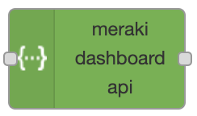
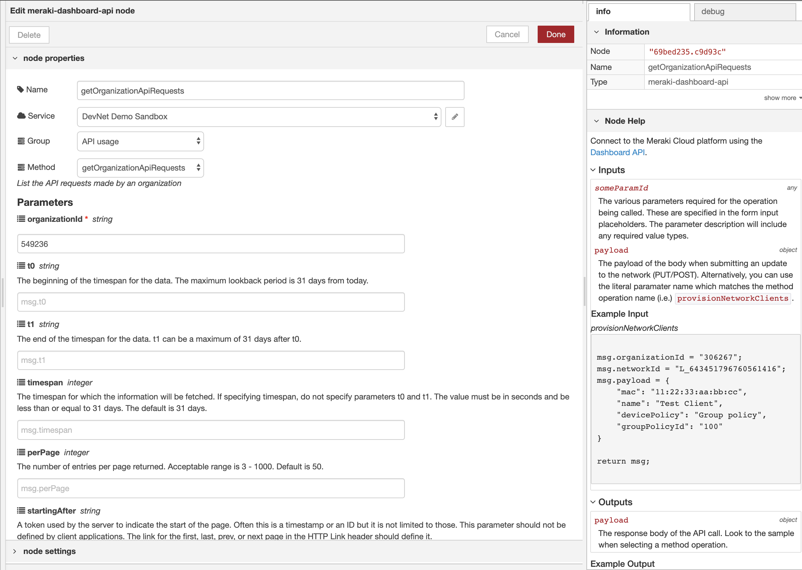
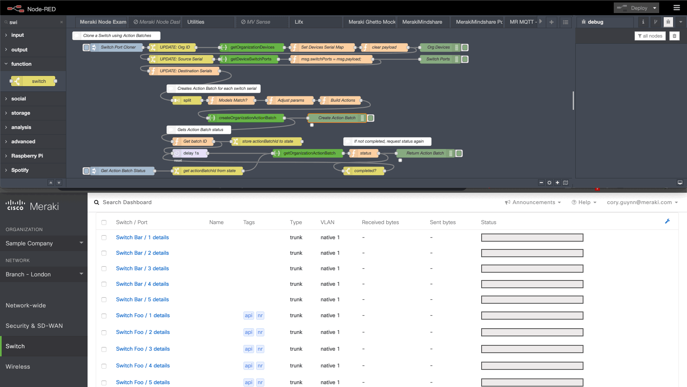

# node-red-contrib-meraki-dashboard-api

Node-RED node for meraki-dashboard-api

> A full featured node for monitoring and managing the Meraki Cloud built on the Dashboard API Open API spec.

[Documentation](https://dexterlabora.github.io/node-red-contrib-meraki-dashboard-api/)

>  

## Overview

Cisco Meraki is a powerful cloud managed network solution. This node is a wrapper based off the Meraki Dashboard API. It leverages the OpenAPI specification to generate the methods and parameters. Now you can quickly monitor and automate the management of your entire network.

### Features

- Over 260 Meraki operations
- Create services to support multiple API keys
- Configure API parameters in the node or dynamically through `msg` object
- Parameters and sample responses are documented in-line
- Several example flows provided

_This example clones switch ports to one or more destination switches. It uses Action Batches to group multiple calls into a single request and periodically checks the state of the batch._

## Install

Run the following command in your Node-RED user directory - typically `~/.node-red`
  
 npm install node-red-contrib-meraki-dashboard-api

## Usage Quick Start

- Add the meraki-dashboard-api node to the flow editor.
- Configure your first API service by double clicking on the node and clicking the pencil icon. Then, paste your Meraki API key in the form.
- Select an operation by navigation the group and method selectors.
- Define any required and optional parameters, either directly in the node or passed in through the input.
- Send any data into the input to see the API response in the output.

[Complete Documentation and Guides](https://developer.cisco.com/docs/meraki-dashboard-api-node-red-node)

---

[Official Meraki Dashboard API Docs](https://create.meraki.io/api)

The Cisco Meraki Dashboard API is a modern REST API based on the [OpenAPI](https://swagger.io/docs/specification/about/) specification.

## Created by

Cory Guynn, 2019

## License

Apache 2.0
