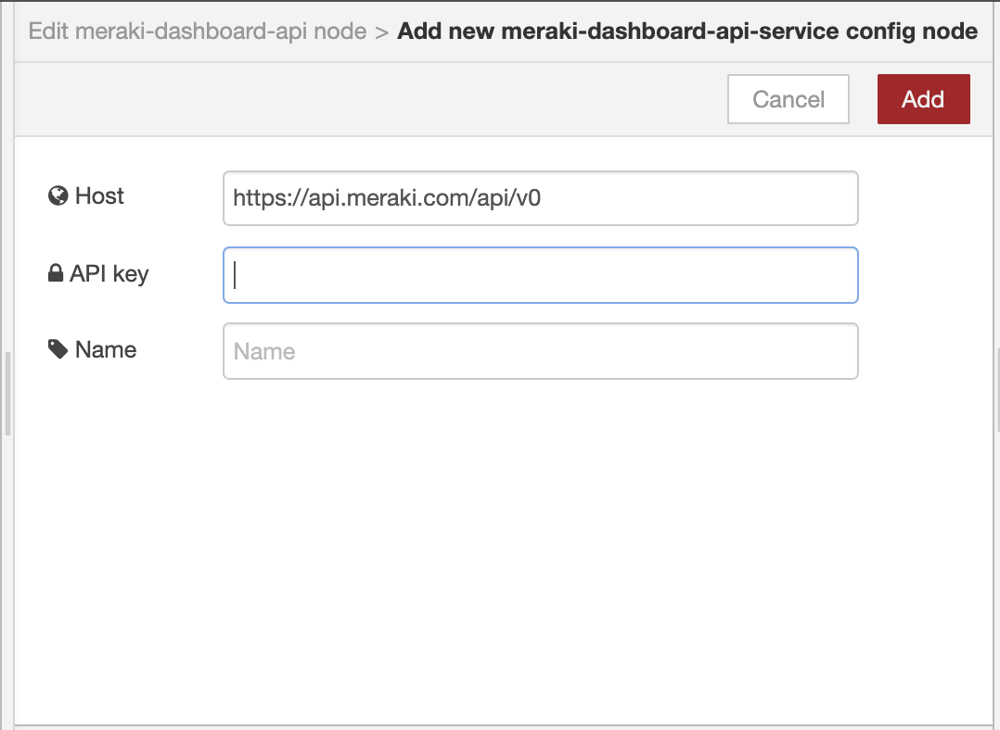
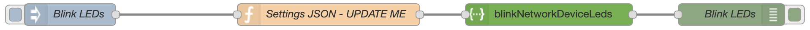

# Getting Started
To make use of the node, it's expected that you have a Cisco Meraki account with API access. See the [Meraki Dashboard API](meraki-dashboard-api.md) section for more details.


### Install

#### via Palette Manager

Open the Node-RED editor and navigate to the palette manager. 

> **Manage palette** --> **Install** --> Search: **meraki-dashboard-api** --> Push: **Install**


#### via CLI

Open a command line, navigate to the Node-RED install directory and then install the node. 

```
cd ~/.node-red
npm install node-red-contrib-meraki-dashboard-api
```
Then, restart node-red.

### Add the node to the flow editor
Find the node from the left palette menu by searching for **meraki** and dragging the node to your editor area. 


### Configure API Service
Double click on the node and then push the **pencil** icon to add a new service and configure its settings.


Set your Meraki API key here. Its a good idea to also name the service for the given API key (i.e. Demo Lab).



### Importing Examples
Several example flows are included to quickly start using the node. You will need to update the nodes with your service settings.  

You can import the built-in examples by selecting them from the menu.
> **Import** --> **Examples** --> **meraki-dashboard-api** --> *select an example*

Or you can get the examples from the source respository [here](https://github.com/dexterlabora/node-red-contrib-meraki-dashboard-api/tree/master/examples).


## Working with Input Data

The node can be programmed with specific parameter variables, such as `organizationId` or `serial`. All parameters are attached to the `msg` object. The `msg.payload` is used to send changes to Meraki and will be used as the body for the API request.

### Using the Node Parameter Form
For quick solutions or static settings, you can use the **Parameters** form within the node. The descriptions are provided for each parameter. The input box for each param accepts a string for the value. 


### Using the Node Input `msg` Object
Within the parameters form, each param name is defined in the input placeholder hint. Use these values to construct a function that assigns the parameter values.




If the parameter name matches the method name, then `msg.payload` can be used. This parameter represents the body being sent with a `PUT` or `POST` request using the Meraki API. 

Use a function node to define the`msg` parameter values.


Double clicking on the node will bring up the JavaScript editor.


## Working with Output Data
### Exploring the Data

Use the **debug** tab to see the output of your data.
You can then view the JSON data and expand the nested properties. 


## [Continue to Guided Samples...](guides.md)