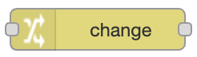
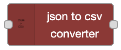
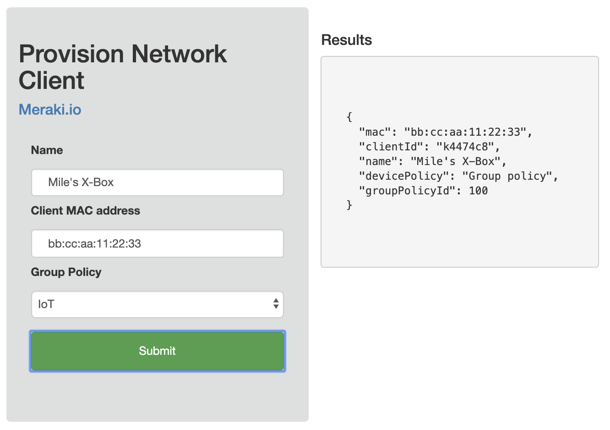

# Guides

The Meraki Dashboard API node is very powerful but with a few helpful techniques, you can take full advantage of it and start building solutions in a couple of clicks. 

## Environment Variables with Flow State

This flow will first define a common set of parameters which is triggered by an initial run of the first flow on Deploy. 


[flow.json](https://github.com/dexterlabora/node-red-contrib-meraki-dashboard-api/blob/master/examples/3.%20Using%20Environment%20Params.json)


To simplify updating common parameters across all of your nodes we will 
use the flow [context](https://nodered.org/docs/user-guide/context) state to store our values. This can be done in a number
of ways, but using the **change** nodes is a quick way to accomplish it. 



The first flow line will use a **change** node to assign the flow context paramaters to values we define here.


The remaining flow lines will then apply the parameters from our `flow` context to the `msg` object when triggered.


To accomomplish this, we need to assign the `msg` property to the `flow` parameter value of the same name.


## Using Function Nodes

You often need to send dynamic parameters and values to the node or construct the payload when submitting data to the Meraki API. By making use of the **function** nodes, you can define the `msg` properties to be sent to the node. 


This flow uses the **function** nodes to build the parameters required for each of the Meraki operations. 


[flow.json](https://github.com/dexterlabora/node-red-contrib-meraki-dashboard-api/blob/master/examples/2.%20Using%20Function%20Params.json)

### Splitting Arrays

Instead of writing multiple function nodes, use the **split** node to convert an array of objects into unqiue `msg` objects for each item in the array. 

 

We can provision network clients from a JSON list and split the client list into individual requests.


A function node creates an array of client objects with their required parameters.


The **split** node will send a `msg` for each item in the array. This means that a client object will be sent to the `provisionNetworkClient` node, one after another.  A limit of 3 msg/s was also put inline to respect the API rate limit.
 

 ## Action Batches

 The Meraki API has the ability to combine multiple "actions" into a single request, where an action is typically a "PUT/POST/DELETE" request. This reduces the frequency of calls to the API where the rate limit and increases the speed for a large number of changes.

 [Meraki Action Batch Docs](https://developer.cisco.com/meraki/api/#/rest/guides/action-batches)

This flow uses **Action Batches** to provision several ports on multiple switches in a single request to Meraki. It then periodically checks the state of the Action Batch ID, when run in an asynchronous mode. 


[flow.json](https://github.com/dexterlabora/node-red-contrib-meraki-dashboard-api/blob/master/examples/Action%20Batches%20-%20Clone%20a%20Switch.json)

Many of the techniques desribed in this guide are applied in this flow. The first line of flow sets the various `msg` parameters, such as `msg.serials`, `msg.portNumbers` and `msg.payload`.

The **Build Actions** function node is where the magic happens. This JavaScript function will iterate through each of the serials and create an action `forEach` serial, applying settings `forEach` of the port numbers. 


Once the action has been sent to Meraki, a response will include the ID of the batch, the status and the actions that were sent. 

We can use the `batchId` by first storing it in our flow context. Then, use a **trigger** node with this ID to `getOrganizationActionBatch` status. If the status has not been completed, the **trigger** will send a new request every second until complete.

## Export to CSV

### Using Built-in CSV Node
You may want to save your payload data to a CSV file for use with a spreadsheet. To do this, we can take advantage of the **csv** node and save the formatted data with the **file** node. 

This flow gets the status of every device in the organization. 


[flow.json](https://github.com/dexterlabora/node-red-contrib-meraki-dashboard-api/blob/master/examples/Export%20to%20CSV%20file.json)

It then sends the data to the **csv** node, which defines the columns based on the expected parameters to be returned from the Meraki operation.


Finally, the data is written to a file. 


### Using json2csv Node

Sometimes the JSON data is nested and challenging to parse. Other times, you just want a flow that accepts any type of response and magically parses it for you. In that case, using the third-party node [json2csv](https://flows.nodered.org/node/node-red-contrib-json2csv) you can simply drop it your flow to perform the parse before saving to a file. Just install it via the [palette manager](https://nodered.org/docs/user-guide/editor/palette/manager)



This flow calls the Meraki API and uses the **json2csv** node to adjust the payload before saving. No additional configurations are required.


[flow.json](https://github.com/dexterlabora/node-red-contrib-meraki-dashboard-api/blob/master/examples/Export%20to%20CSV%20file%20-%20json2csv.json)


## Merging Data with Multiple API calls

Many times you may want to run a few API calls and then combine the data. 

This flow illustrates two ways to accomplish this. 


[flow.json](https://github.com/dexterlabora/node-red-contrib-meraki-dashboard-api/blob/master/examples/Store%20and%20Merge%20data.json)

### Option 1

Use a function node to loop through each item of the response array and assign additional properties from our state. 


The function uses the JavaScript `map` method to loop through each item in the resposne array and assign the properties for the given `admiId` in this example.


### Option 2

Use a pair of **split/join** nodes to handle the loop for us, and use a simpler **function** node to copy the extra info to the `msg` object.


The function node will now only focus on assigning extra data to the `msg` object. 


## Webhooks

Meraki provides a way to send a webhook when an alert is triggered in the Meraki Dashboard.


[flow.json](https://github.com/dexterlabora/node-red-contrib-meraki-dashboard-api/blob/master/examples/Webhooks%20with%20workflows.json)

The flow includes two sample payloads that can be used to test and explore the payload. 

*Here is an example payload received from a Meraki webhook. We just assign the entire object to the `msg.payload`*

```
msg.payload = {
  "version": "0.1",
  "sharedSecret": "foo",
  "sentAt": "2019-07-19T06:20:39.656975Z",
  "organizationId": "00000001",
  "organizationName": "Miles Monitoring Inc.",
  "organizationUrl": "https://n1.meraki.com/o//manage/organization/overview",
  "networkId": "N_111111111111",
  "networkName": "Main Office",
  "networkUrl": "https://n1.meraki.com//n//manage/nodes/list",
  "alertId": "0000000000000000",
  "alertType": "Settings changed",
  "occurredAt": "2019-07-19T06:15:33.504142Z",
  "alertData": {
    "name": "Routing and DHCP",
    "url": "/manage/configure/switch_l3",
    "changes": {
      "createStaticRoute": {
        "label": "Added static route on SP-Warehouse",
        "newText": "10.10.10.0/24 -> 172.16.254.253",
        "changedBy": "Miles Meraki (Miles@Meraki.com)",
        "oldText": "",
        "ssidId": null
      }
    },
    "userId": "646829496481136255"
  },
  "deviceSerial": "XXXX-XXXX-XXXX",
  "deviceMac": "00:00:00:aa:bb:cc",
  "deviceName": "Device Foo Bar",
  "deviceUrl": "https://n1.meraki.com//n//manage/nodes/new_list/000000000000"
}
return msg;
```

The basic concept is to create an API endpoint that accepts a `POST` HTTP request. We will name the path `/merakiWebhooks` in this example which creates a route of https://localhost:1880/merakiWebhooks to your Node-RED server. 

> Meraki requires a public facing HTTPS URL to send alerts. Please read the official [Webhooks docs](https://developer.cisco.com/meraki/webhooks/) for more information. 
> 

**Dev Tip**: create a secure reverse-proxy by typing ` ssh -R 80:localhost:1880 serveo.net` in the terminal. This free service will expose port `1880` to port `443` on a dynamic host.
```
$  ssh -R 80:localhost:1880 serveo.net
Forwarding HTTP traffic from https://miscui.serveo.net
Press g to start a GUI session and ctrl-c to quit.

```
Your Node-RED webhook URL will now be available at 
https://miscui.serveo.net/merakiWebhooks in this example.

### Workflows

By using the **link** nodes, we are able to join the output from our webhook data to different flows through-out our application. We then use a **switch** node to route the flow based on the `msg.payload.alertType` parameter. 


#### Settings changed
This workflow will be triggerd upon the `alertType` of `Settings changed`. It then maps additional properties to the alert by initially calling the `getOrganizationAdmins` operation and storing the response to the flow state. 

The payload of the `Setting changed` alert only contains the `adminId`. It would be helpful to get more info about the admin, such as a name and email before sending this data to some destination. To accomplish this, we merge the data with the alert payload.


#### Switch port connected
This workflow will trigger a dynamic API request using the Meraki node to collect extra details about the port that was just connected to. 

To accomplish this, the **batch** and **join** nodes can be used to combine the two sets of data into an array of objects.


This output shows the array having 2 objects, one for the alert data and another for the switch port details.


## Web Form

Add a front-end web form to your Node-RED application. The example provides a simple form to register a network client. This is common for an IoT self-service portal with a WiFi network. 


This flow will present an HTML page by creating an HTTP `GET` path and responding with the combination of JS, CSS & HTML **template** nodes that build a web page. 

It also provides an HTTP `POST` path, which will handle the form submission.


The JavaScript template will handle extracting the values from the web form and making and API request to our `POST` endpoint.


The HTML template will create the web form, where each input box will represent a parameter in our `msg.payload`. 


Once the data has been received from the form, a **function** node will adjust the `msg` object with the required format for the Meraki node to provision the client. 


Once the API request has been completed by the Meraki node, the results will be sent back to the web client to confirm the status. A `clientId` will now be included with submitted details.




## Additional Resources

- Fun IoT project with LEGO - http://www.internetoflego.com
- Node-RED Guide - http://noderedguide.com/

