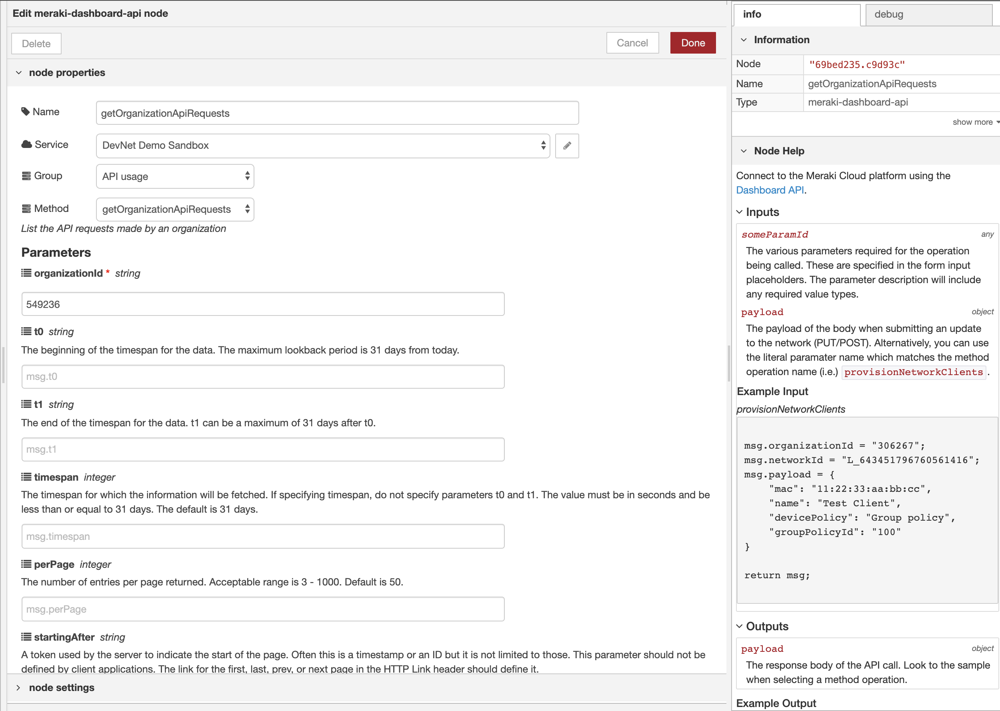

# Meraki Dashboard API Node-RED Node
`node-red-contrib-meraki-dashboard-api` 
>  

## Overview

Cisco Meraki is a powerful cloud managed network solution. This node is a wrapper based off the Meraki Dashboard API. It leverages the OpenAPI specification to generate the methods and parameters. Now you can quickly monitor and automate the management of your entire network. 

### Features
* Over 260 Meraki operations
* Create services to support multiple API keys
* Configure API parameters in the node or dynamically through `msg` object
* Parameters and sample responses are documented in-line
* Several example flows provided

This example clones switch ports to one or more destination switches. It uses Action Batches to group multiple calls into a single request and periodically checks the state of the batch.

# [Getting Started](getting-started.md)

# [Meraki Dashboard API](meraki-dashboard-api.md)

# [Guides](guides.md)

