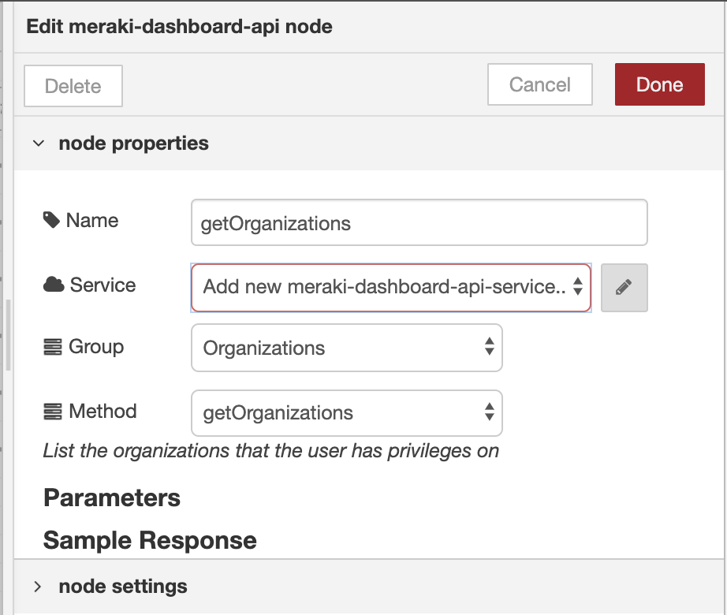

# Meraki Dashboard API Node-RED Node
`node-red-contrib-meraki-dashboard-api`


## Overview

Cisco Meraki is a powerful cloud managed network solution. This node is a wrapper based off the Meraki Dashboard API. It leverages the OpenAPI specification to generate the methods and parameters. Now you can quickly monitor and automate the management of your entire network. 

### Features
* Over 260 Meraki operations
* Create services to support multiple API keys
* Configure API parameters in the node or dynamically through `msg` object
* Parameters and sample responses are documented in-line
* Several example flows provided


This example clones switch ports to one or more destination switches. It uses Action Batches to group multiple calls into a single request and periodically checks the state of the batch.


## Getting Started
To make use of the node, it's expected that you have a Cisco Meraki account with API access. See below for more details.


### Install

#### via Palette Manager

Open the Node-RED editor and navigate to the palette manager. 

> **Manage palette** --> **Install** --> Search: **meraki-dashboard-api** --> Push: **Install**


#### via CLI

Open a command line, navigate to the Node-RED install directory and then install the node. 

```
cd ~/.node-red
npm install node-red-contrib-meraki-dashboard-api
```
Then, restart node-red.

### Add the node to the flow editor
Find the node from the left palette menu by searching for **meraki** and dragging the node to your editor area. 


### Configure API Service
Double click on the node and then push the **pencil** icon to add a new service and configure its settings.



Set your Meraki API key here. Its a good idea to also name the service for the given API key (i.e. Demo Lab).


### Importing Examples
Several example flows are included to quickly start using the node. You will need to update the nodes with your service settings. 


## Working with Input Data

The node can be programmed with specific parameter variables, such as `organizationId` or `serial`. All parameters are attached to the `msg` object. The `msg.payload` is used to send changes to Meraki and will be used as the body for the API request.

### Using the Node Paramater Form
For quick solutions or static settings, you can use the **Parameters** form within the node. The descriptions are provided for each parameter. The input box for each param accepts a string for the value. 


### Using the Node Input `msg` Object
Within the parameters form, each param name is defined in the input placeholder hint. Use these values to construct a function that assigns the parameter values.


If the parameter name matches the method name, then `msg.payload` can be used. This parameter represents the body being sent with a `PUT` or `POST` request using the Meraki API. 

Use a function node to define the`msg` parameter values.


## Working with Output Data
### Exploring the Data

Use the **debug** tab to see the output of your data.
You can then view the JSON data and expand the nested properties. 


# Meraki Dashboard API
The Cisco Meraki Dashboard API is a modern REST API based on the [OpenAPI](https://swagger.io/docs/specification/about/) specification.

## What can the API be used for?
The Dashboard API can be used for many purposes. It's meant to be an open-ended tool. Here are some examples of use cases:

* Add new organizations, admins, networks, devices, VLANs, and more
* Configure networks at scale
* Automatically on-board and off-board new employees' teleworker setups
* Build your own dashboard for store managers, field techs, or unique use cases


## Getting a Dashboard API Key

1. Begin by logging into [Meraki Dashboard](https://dashboard.meraki.com) and navigating to **Organization > Settings**

2. Locate the section titled **Dashboard API access** and select **Enable Access**, then **Save** your changes

3. After enabling the API, choose your username at the top-right of the Meraki Dashboard and select **my profile**

4. Locate the section titled **Dashboard API access** and select **Generate new API key**

*Note: The API key is associated with a Dashboard administrator account. You can generate, revoke, and regenerate your API key on your profile.*

**Keep your API key safe as it provides authentication to all of your organizations with the API enabled. If your API key is shared, you can regenerate your API key at any time. This will revoke the existing API key.**

Copy and store your API key in a safe place. Dashboard does not store API keys in plaintext for security reasons, so this is the only time you will be able to record it. If you lose or forget your API key, you will have to revoke it and generate a new one.

Every request must specify an API key via a request header.

The API key must be specified in the URL header. The API will return a 404 (rather than a 403) in response to a request with a missing or incorrect API key in order to prevent leaking the existence of resources to unauthorized users.

`X-Cisco-Meraki-API-Key: <secret key>`

Read more about API [authorization](../api/#/python/getting-started/authorizing-your-client)


## Versioning
Once an API version is released, we will make only backwards-compatible changes to it. Backwards-compatible changes include:

* Adding new API resources

* Adding new optional request parameters to existing API methods

* Adding new properties to existing API responses

* Changing the order of properties in existing API responses

## Rate Limit
* The Dashboard API is limited to **5 calls per second**, per organization.
* A burst of 5 additional calls are allowed in the first second, so a maximum of 15 calls in the first 2 seconds.
* The rate limiting technique is based off of the [token bucket model](https://en.wikipedia.org/wiki/Token_bucket).
* An error with a `429` status code will be returned when the rate limit has been exceeded.
* Expect to backoff for 1 - 2 seconds if the limit has been exceeded. You may have to wait potentially longer if a large number of requests were made within this timeframe.

# Troubleshooting

###  Only "get" methods work.
- Does your API key have write permissions?
- Use your organizations subdomain instead of the default base URL.
	- In your node's Service configuration, change the URL from `https://api.meraki.com/api/v0` to `https://n123.meraki.com/api/v0` where `n123` matches the subdomain of your Meraki Dashboard when you are logged in.


